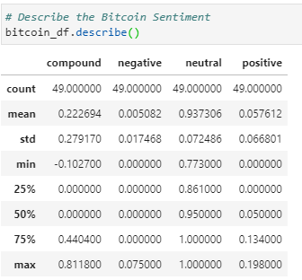
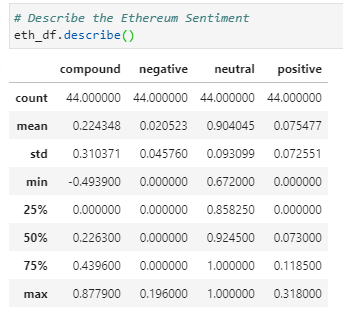
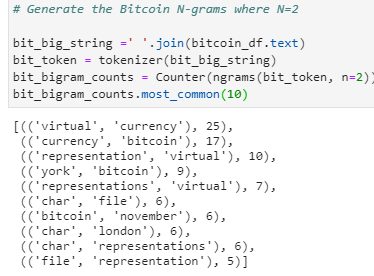
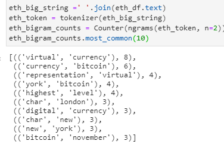
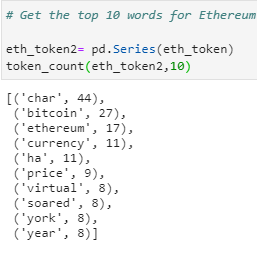
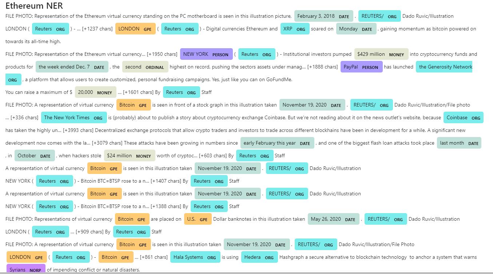

# Tales from the Crypto (Unit 12 Homework)

### Introduction

This analysis looks at Bitcoin and Ethereum news articles pulled from NewsAPI. I used 50 pages worth of relevant articles for each cryptocurrency. This analysis is divided into 3 parts:

1. [Sentiment Analysis](#Sentiment_Analysis) 
2. [Natural Language Processing (NLP)](#NLP)
3. [Named Entity Recognition (NER)](#NER)

### Sentiment Analysis 

For this section, I used polarity scores from the nltk libary to determine the compound, positive, negative and neutral scores for each cryptocurrency. Below are the table of results:

Looking at the proportion of negative, netural and positive sentiments, We can see that the sentiment for both cryptocurrencies is mostly neutral. And using the descriptive statistics above, we have the following conclusions:

- Ethereum had the highest mean positive score at .0754
- Ethereum had the most negative score with a minimum compound rate of -0.4939
- Ethereum also had the most positive score with the maximum compound rate of 0.8779

### Natural Language Processing 

In this section, I split the contents of each article into tokens, each with lowercase and without punctuation. In addition to the usual dictionary of english stopwords, I also included these stopwords:

`sw_addons = {'reuters','photo','seen', 'illustration', 'taken', 'reutersdado', 'stafffile', 'dado', 'ruvic', 'basically', 'also'}`

These were frequently used words that came up because they referred to the source of the news (Reuters) and to descriptions of photos or photogrophers that usually accompany the news articles. I decided to remove them from my analysis since they don't really form part of the content.

After cleaning up the articles and converting them to tokens, I looked for the most common bigrams for Bitcoin and Ethereum. The results are shown below and we can see that some of the most frequent bigrams are similar between the two crypocurrencies. This is expected since they are competitors/alternatives to each other and would be described in articles similarly. They are also likely tp be mentioned together in the same articles. 

Apart from the bigrams, I also looked at the 10 most frequently used words for each crypocurrency, results are shown below:

Lastly, I rended the tokens above into a word cloud that would summarize the news for each coin. What is interesting in these results is that the word "Bitcoin" was mentioned more frequently than "Ethereum" in the Ethereum news dataframe. 

### Named Entity Recognition 

In this last section, I used a named entity recognition model for both coins and visualized the tags using Spacy.

### Notes

[Jupyter Notebook](https://github.com/nikanikachan/HW12_NLP/blob/main/crypto_sentiment.ipynb)

Note that the newsAPI articles are live. When running the notebook, the results might be different than what you see in the screenshots above.

