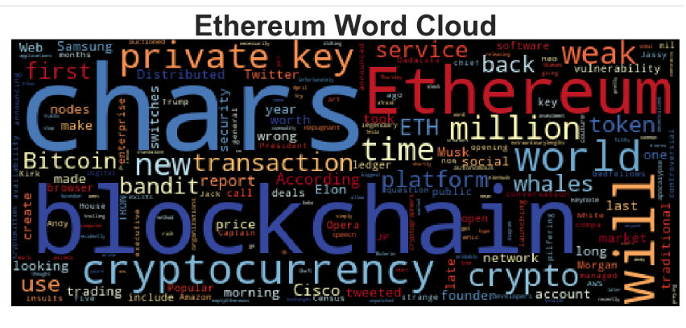

# Tales from the Crypto (Unit 12 Homework)

### Introduction

This analysis looks at Bitcoin and Ethereum news articles pulled from NewsAPI. I used 50 pages worth of relevant artciles for each cryptocurrency topic. This analysis is divided into 3 parts:

1. Sentiment Analysis (#Sentiment_Analysis)
2. Natural Language Processing (NLP) (#NLP)
3. Named Entity Recognition (NER) (#NER)

### Sentiment Analysis 

For this section, I used polarity scores from the nltk libary to determine the compound, positive, negative and neutral scores for each cryptocurrency. Below are the table of results:

Using descripting statistics above, we have the following conclusions:
- Ethereum had the highest mean positive score at .0754
- Ethereum had most negative score with a minimum compound rate of -0.4939
- Ethereum also had the most positive score with the maximum compound rate of 0.8779

### Natural Language Processing 

In this section, I split the contents of each article into tokens, each with lowercase and without punctuation. In addition to the usual dictionary of english stopwords, I also included these stopwords

`sw_addons = {'reuters','photo','seen', 'illustration', 'taken', 'reutersdado', 'stafffile', 'dado', 'ruvic', 'basically', 'also'}'

These were frequently used words that came up because they referred to the source of the news (Reuters) and to descriptions of photos or photogrophers that usually accompany the news articles. They should not be considered because they are not really part of the article's content.

After cleaning up the articles and converting them to tokens, I looked for the most common bigrams for Bitcoin and Ethereum. The results are shown below and we can see that most of the bigrams are similar in both sets keywords. Presumbaly, there are in the same articles that were pulled and are also considered as alternatives to each other, so would be described similarly.

And then I looked at the 10 most frequently used words for each keyword which is shown below:

Lastly, we rended the tokens above into a word cloud that would summarize the news for each coin.

### Named Entity Recognition 

In this section, I used a named entity recognition model for both coins and visualized the tags using Spacy

